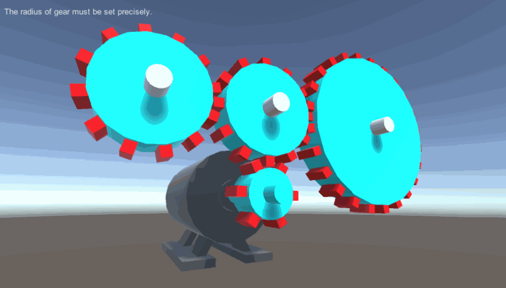
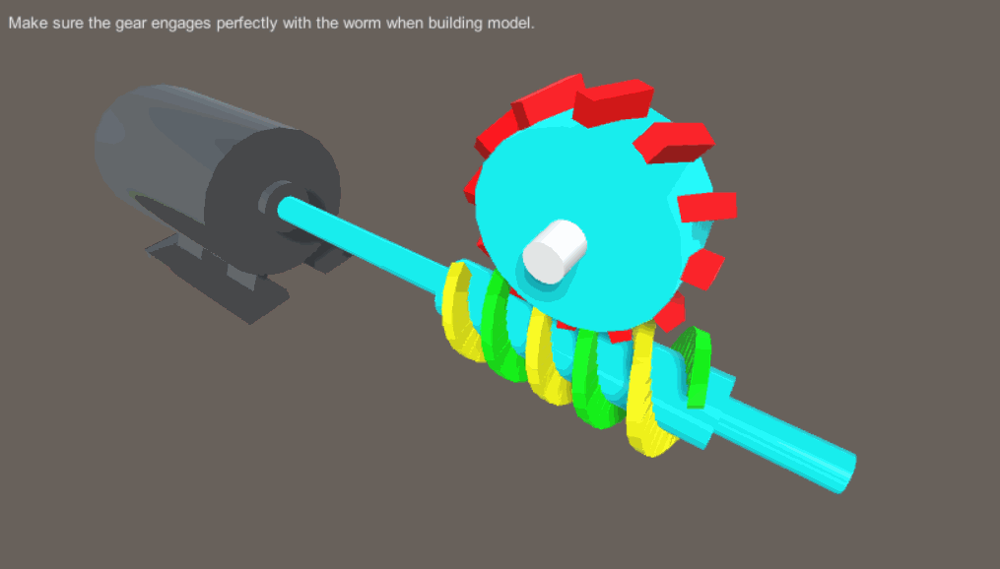
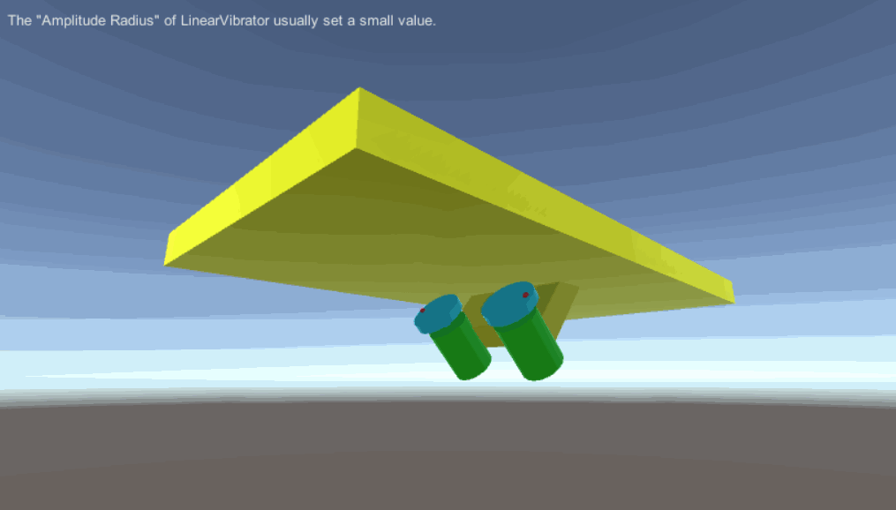
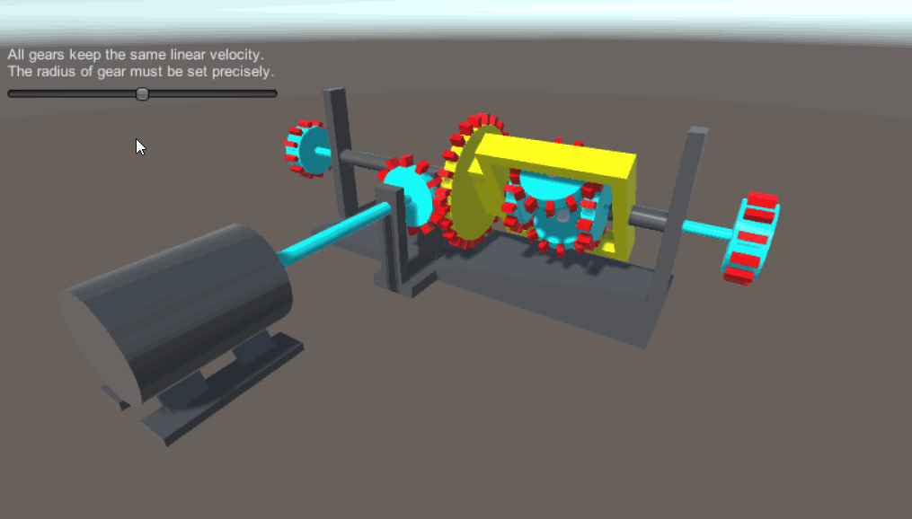

# MGS-MechanicalDrive
- [中文手册](./README_ZH.md)

## Summary
- Unity plugin for binding mechanical drive in scene.

## Demand
- Binding mesh Gear.
- Binding worm gear.
- Binding belt flywheel.
- Binding vibrator.
- Binding differential.
- Binding transmission.

## Environment
- Unity 5.0 or above.
- .Net Framework 3.0 or above.

## Achieve
- Gear : Gear rotate around axis Z.
- Axle : Axle rotate around axis Z.
- CoaxialGear : Coaxial gear with the same axis as another gear.
- WormGear : Worm gear mechanism.
- WormShaft : Worm shaft mechanism.
- Belt : Move texture UV on X axis.
- LinearVibrator : Reciprocating motion on Z axis.
- CentrifugalVibrator : Eccentric motion around Z axis.
- Synchronizer : All mechanisms of the synchronizer driven by same
   velocity.
- Transmission : All mechanisms of the Transmission driven by
   proportional velocity.
- Engine : Unified engine drive all mechanisms. 
- Differential : Ordinary differential.

## Demo
- Prefabs in the path "MGS-MechanicalDrive/Prefabs" provide reference to you.
- Demos in the path "MGS-MechanicalDrive/Scenes" provide reference to you.

## Preview
- Mesh Gears

- Mesh Gears

- Belt

- Worm Gear

- Vibrosieve

- Differential

- Transmission

## Contact
- If you have any questions, feel free to contact me at mogoson@outlook.com.