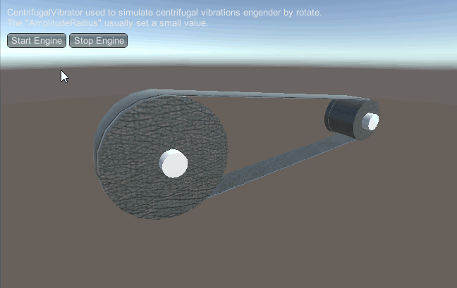

# MGS-MechanicalDrive
- [English Manual](./README.md)

## 概述
- Unity 绑定机械传动插件包。

## 需求
- 绑定啮合齿轮传动机构。
- 绑定蜗轮蜗杆传动机构。
- 绑定皮带飞轮传动机构。
- 绑定差速器传动机构。
- 绑定变速器传动机构。
- 绑定振荡器。

## 环境
- Unity 5.0 或更高版本。
- .Net Framework 3.0 或更高版本。

## 实现
- Gear：齿轮，绕Z轴向作圆周运动。
- Axle：转轴，绕Z轴向作圆周运动。
- CoaxialGear ：共轴轮，与另一个齿轮共轴，只输出转速，不转动。
- WormGear：绑定蜗轮。
- WormShaft：绑定蜗杆。
- Belt：传送带，UV沿X方向移动模拟运转。
- LinearVibrator：线性振动器，沿Z轴向作往复运动。
- CentrifugalVibrator：离心振动器，绕Z轴向作离心运动。
- Synchronizer：同步器，统一线速度驱动同步器的所有机构。
- Transmission：变速器，按指定比例线速度驱动变速器的相应机构，用于协调多个机构的运转。
- Engine：引擎，统一驱动所有机构。
- Differential：普通差速器。

## 案例
- “MGS-MechanicalDrive/Prefabs”目录下存有上述机械传动绑定的预制，供读者参考。
- “MGS-MechanicalDrive/Scenes”目录下存有上述机械传动绑定的演示案例，供读者参考。

## 预览
- MeshGears

- WormGear

- Belt

- Vibrosieve

- DynamicChainSys

- DynamicRollerChainSys

- NodeEditor

## 联系
- 如果你有任何问题或者建议，欢迎通过mogoson@outlook.com联系我。